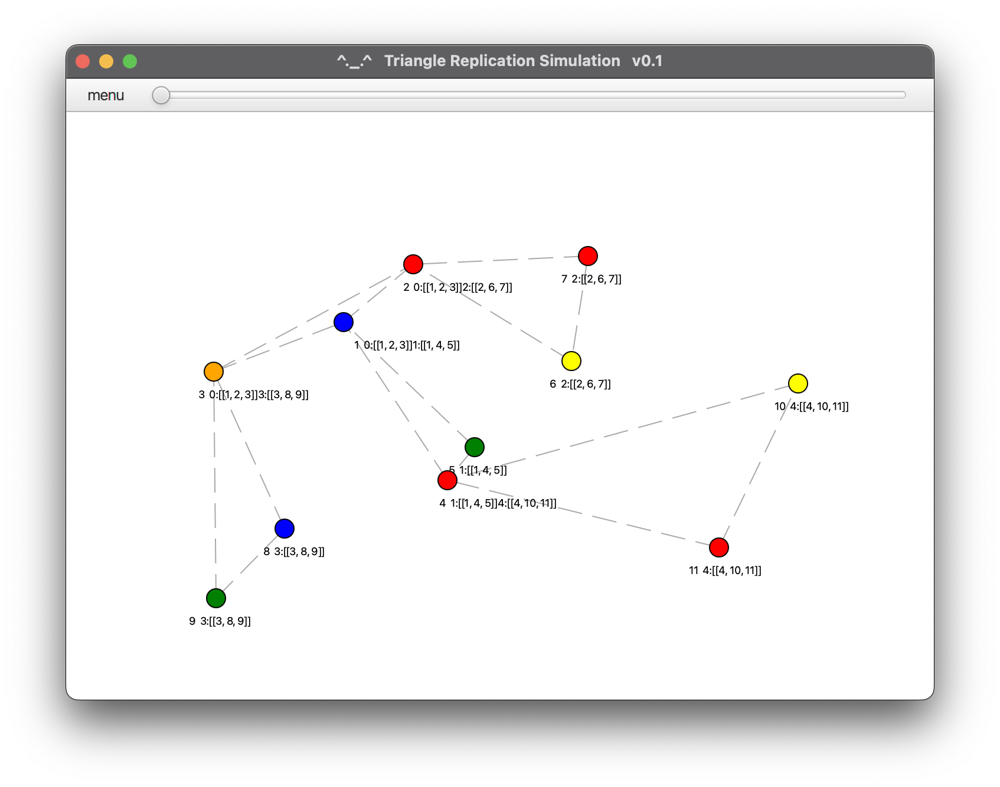
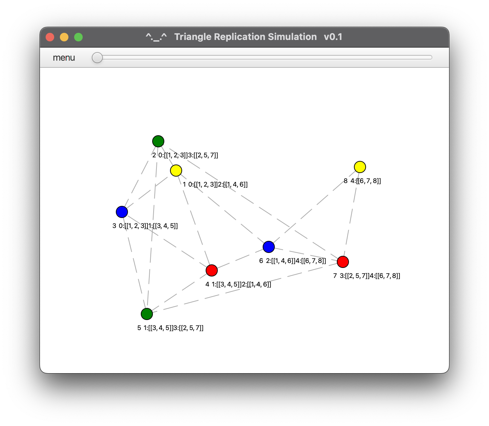

# Triangle Replication Network Simulator
Based on Distributed Algorithms Simulator currently maintained by the [Distributed Systems Group](http://www.uni-kassel.de/eecs/vs) (*info(at)das-lab.net*) and original developed by Thomas Weise (GitHub profile https://github.com/thomasWeise, website http://iao.hfuu.edu.cn/5)

Download
--------
Clone repository with: `git clone --recurse-submodules -j8 git@github.com:nio-core/triangle-replication.git`

